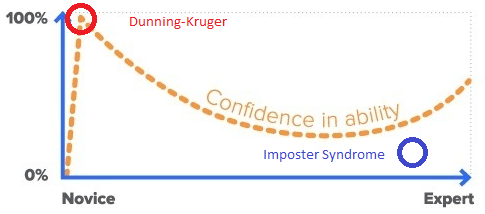

# 3. "Inclusion in Tech" | 2018-Q3 Presentations
## Rogeema Kenny [@rogeema](https://twitter.com/rogeema)
1. Inclusion takes deliberate action and deliberate interventions
	1. __Teaching__: Giving someone a new skill
	2. __Mentoring__: Giving guidance and support to someone that is already competent
2. Involved in the __Africa Code Week__ event
	1. Aimed at children, but expanded to include adults too
	2. Takes a deliberate focus on women
3. Need to break down the cycle of only certain types of people getting into coding
	* Must take it into the schools
4. Mentors guide, support, challenge - they will make you uncomfortable if that is what you need to grow
	1. A mentor may be a role-model, but it is seldom that a role-model could be a mentor (e.g. Mandela would be a role-model, but you wouldn't have had access to him to have him as a mentor)
	2. A manager in your reporting line wouldn't be a good choice for a mentor as there may be a conflict (they will be looking out for the company's interests, not your own)
	3. Your mentor is generally someone older and more experienced.  They should be someone that you respect - just go ask them
5. You should look at being a mentor and a mentee at some stage to give yourself the best opporunity to grow
6. Look after your relationships
7. The projects run with school students had a focus on entrepreneurship
	1. The girls were encouraged to start a business with only R150 - they could keep their profits
	2. Many of the girls made over R2,000 profit in the end
	3. Adults saying that __you can't make money without money__ is *__B.S.__*
8. [Impostor syndrome](https://en.wikipedia.org/wiki/Impostor_syndrome) is the feeling that you don't deserve the position you are in
	* When something good happens, you always say that you were "lucky" or "it was a team effort" or "the circumstances were favourable" (externalise) instead of internalising the success
9. A few years back, Rogeema joined [Mensa](https://mensa.org.za/), a society for persons with an I.Q. in the top 2 %
	1. She was asked to take on the role of editor for their quarterly newsletter, but felt very intimidated due to the highly intellectual nature of the information published in the newsletter
	2. She didn't allow her __Imposter syndrome__ to stop her - instead she made the newsletter her own by adding her own flare and humour - which was very well received based on email feedback she received from many of the readers, with one reader saying "the newsletter has become a breath of fresh air"
	3. __Be yourself!  Everyone else is already taken.__
10. The opposite of __Imposter syndrome__ is the [Dunning–Kruger effect](https://en.wikipedia.org/wiki/Dunning–Kruger_effect)
	
11. How do you get over __Imposter syndrome__?
	1. You need to apply __introspection__ to understand why _you_ are in the position.  It may turn out that the role is really not right for you (i.e. it isn't Imposter syndrome)
		* One woman that Rogeema met at an _Instagram_ panel on overcoming obstacles, shared how she overcame her insecurities at Google (and later Facebook) due to working in Tech, but having vast experience in film and media - her solution was to change her attitude about herself and stop apologising.  She recognised that she was doing a good job and that helped her manage the feeling.
	2. Speak to people to get feedback - you hope that they will just laugh at you and tell you that you're being silly.
	3. Speak to your mentor as they will be brutally honest with you
	4. __Embrace failure as part of learning__.  Get out of your comfort zone and remember that the master has failed more times and has learned from it
12. In closing, a few __Did you know__ facts:
	1. ... 41 % of women leave tech companies within 10 years of graduating.  Some never even enter it as they didn't enjoy how they were treated whilst studying
	2. ... Women are better coders based on approval rates on GitHub (but only if gender was not disclosed)
	3. ... We can only say that Tech is inclusive when there are more average women in Tech
		* Why should women have to be twice as good or work twice as hard as men
13. Food for thought:  *__"The quality of your life is dependent on the questions that you ask."__*
